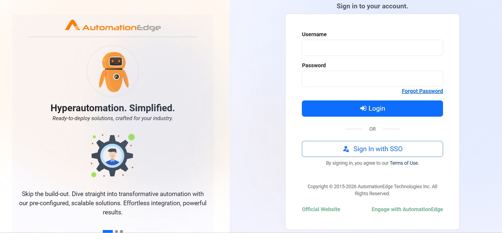
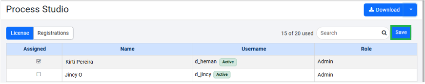
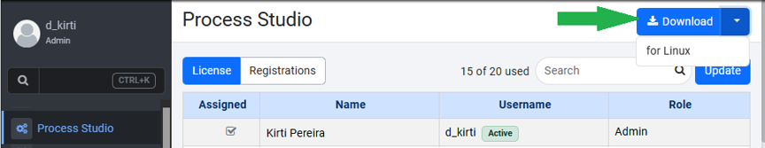
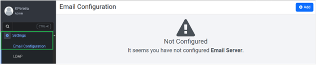

__Getting Started with AutomationEdge Process Studio__

Table of Content
- [Introduction](#introduction)
- [Prerequisites](#prerequisites)
  - [Set up AutomationEdge Cloud Instance](#set-up-automationedge-cloud-instance)
  - [Assign Process Studio License](#assign-process-studio-license)
  - [Download Process Studio](#download-process-studio)
  - [Set Up Email Configuration](#set-up-email-configuration)
    - [Prerequisites](#prerequisites-1)

# Introduction

AutomationEdge Process Studio is a Java based tool for designing and developing workflows. In Process Studio you can create workflow using orchestration of ready tasks. 

This guide helps System Administrators set up AutomationEdge Process Studio by registering a cloud instance, assigning licenses, downloading Process Studio, configuring email and creating a sample project. 

# Prerequisites
* A valid username
* A temporary password from IT team
* A valid network connection
* A valid tenant license
* An internet browser 

## Set up AutomationEdge Cloud Instance
Register the AutomationEdge Cloud instance to access Process Studio and manage tenant resources.

__Prerequisites__
  
  * A valid userame
  * A temporary password from the IT team
  * An internet browser
  
  To create an account,
   
1. Navigate to https://t3.automationedge.com/ in your browser.
2. On the Login screen, perform the following:
   

   a. In the Username field, enter username.
   
   b. In the Password field, enter temporary password.

   c. Click __Log In__.

  You are now redirected to the Change Password screen. 

>Note: As a system administrator, when you log in for the first time, you must change your temporary password.

3. On the __Change Password__ screen, perform the following:

   
   a. In the __Old Password__ field, enter the temporary password.

   b. In the __New Password__ field, enter the desired password.

   c. In the __Confirm Password__ field, re-enter the desired password.
   d. Click __Change__.

You are redirected to the Login screen again. 
>Note: System administrators can use Forgot Password link to reset password.

4. On the Login screen, enter your username and password.

On successful Login, the __Set Security Questions__ page appears on the screen.

5. On the __Set Security Questions__ page, select one of the following options:

   
   * Click __Skip__ and continue. 
   * Select desired security question from the given list and Click __Save__. 
  

The AutomationEdge Process Studio main Home screen appears.

## Assign Process Studio License
Assign a Process Studio license to enable users to access Process Studio. Without an active license, users cannot use Process Studio.

__Prerequisites__

* Access to AutomationEdge Cloud Instance

To assign the license,

1. In the menu click __Process Studio__. 
2. On the __Process Studio__ page, click __Update__.
3. In the __Assigned__ column section, select the user to assign the license. 
4. On the right pane of screen, click __Save__.

Process Studio license is assigned to the desired user. 

## Download Process Studio
Download Process Studio for Window or Linux. 

__Prerequisites__
* Access to AutomationEdge Cloud Instance
* A valid Process Studio license

To download,

1.  On the __Process Studio___ -> __Registrations__ page, click __Download__.

AutomationEdge appends the Tenant Organization Code to the downloaded Process Studio folder name.

>Note: The downloaded Process Studio is bundled with Java for the corresponding OS.

## Set Up Email Configuration
Configure an SMTP email to enable AutomationEdge to send email notifications.

### Prerequisites
* Access to AutomationEdge Cloud Instance
* A valid Process Studio license

To set up,

1. In the __Process Studio__ menu, click __Settings__ 🡒 __Email Configuration__.
   

2. On the __EmaiConfiguration__ page, click __Add__.
   
   The __Email Configuration__ dialog appears on the screen.

3. In the configuration type, select __SMTP Configuration__.
   

4. In the __Email Configuration__ field, enter details

| Field | Description |
|-------|-------------|
| **Host*** | Enter the hostname or IP address of the SMTP server. For example, `smtp.gmail.com`. |
| **Port*** | Enter the SMTP server port number. Common ports include **465** for SSL and **587** for TLS. |
| **Authenticate** | Select this option to authenticate with the SMTP server.  **Note:** The **Password** field is available only when authentication is enabled. |
| **Username*** | Enter the username used to authenticate with the SMTP server. |
| **Password*** | Enter the password used to authenticate with the SMTP server. |
| **Encryption Type** | Select the encryption type:  - **None** – No encryption. - **SSL** – Uses Secure Sockets Layer (SSL) encryption. - **TLS** – Uses Transport Layer Security (TLS) encryption. When you select **TLS**, the **Protocol** field becomes available. Select one or more supported protocols. |
| **Personal Name** | Enter the sender name that appears in outgoing emails. |
| **Allowed Domains** | Enter the domains that are allowed to receive emails. Separate multiple domains with commas or press **Enter** after each domain.  For example, if you add `gmail.com`, emails can be sent only to Gmail users. 

>Note: '*'indictes fields are mandatory.

5. Click __Test__ to validate SMTP connectivity.
   
A message appear on the screen confirming the success of connectivity.
6. Click __Save__.

The SMTP configuration is saved. To modify the configuration, click Edit.
