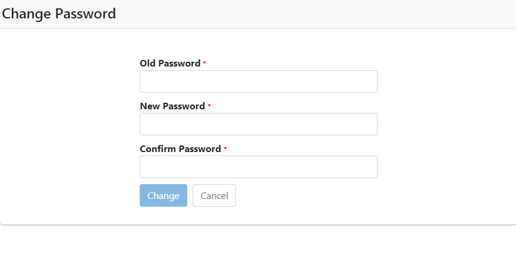
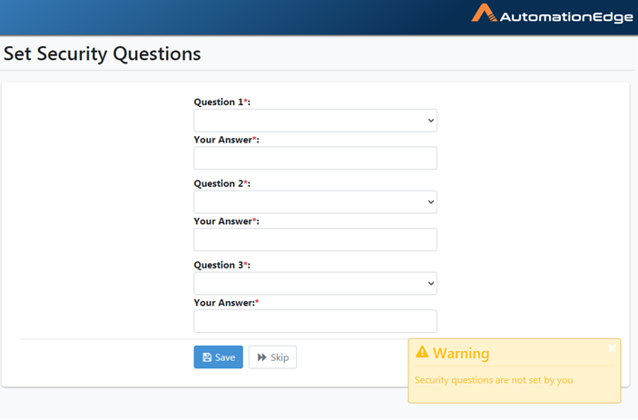
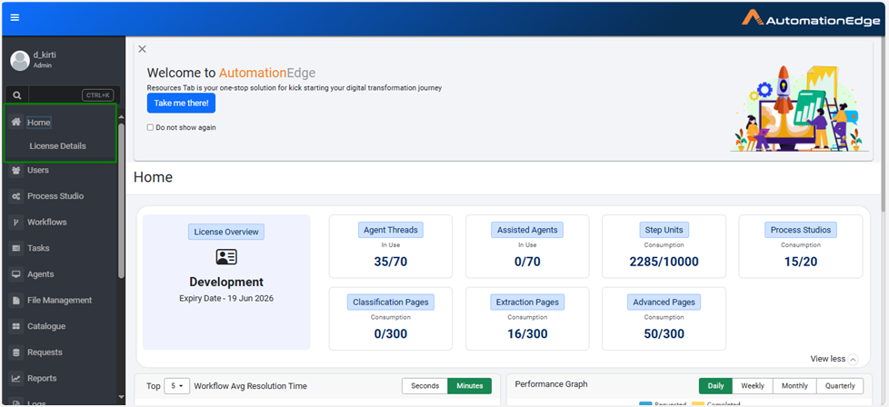
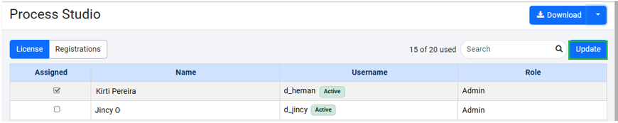

# Getting Started with AutomationEdge Process Studio
Table of Content
- [Getting Started with AutomationEdge Process Studio](#getting-started-with-automationedge-process-studio)
- [Introduction](#introduction)
- [Prerequisites](#prerequisites)
- [Getting Started](#getting-started)
  - [Set up AutomationEdge Cloud Instance](#set-up-automationedge-cloud-instance)
  - [Assign Process Studio License](#assign-process-studio-license)
  - [Download Process Studio](#download-process-studio)

# Introduction

AutomationEdge Process Studio is a Java based tool for designing and developing workflows. In Process Studio you can create workflow using orchestration of ready tasks. 

This document is to help system administrators onboard the AutomationEdge platform. It covers the registeration of AutomationEdge cloud instance, downloading Process Studio, adding a tenant, and assignising license. 

# Prerequisites
* A valid username
* A temporary password from IT team
* A valid network connection
* A valid tenant license
* An internet browser 

# Getting Started
In the chapter you learn how to- 
* Set up AutomaitonEdge Cloud Instance
* Assign Process Studio License
* Download Process Studio

## Set up AutomationEdge Cloud Instance
The AutomationEdge Cloud Instance acts as the gateway to access Process Studio, enabling users to log in, view their assigned licenses, and start building automation workflows.

This section guides users through the registration process required to access the AutomationEdge platform and unlock Process Studio functionality.

__Prerequisites__
  
  * A valid userame
  * A temporary password from the IT team
  * An internet browser
  
  To create an account,
   
1. Navigate to https://t3.automationedge.com/ in your browser.
2. On the Login screen, perform the following:
   

   a. In the Username field, enter username.
   
   b. In the Password field, enter temporary password.

   c. Click __Log In__.

  You are now redirected to the Change Password screen. 

>Note: As a system administrator, when you log in for the first time, you must change your temporary password.

3. On the __Change Password__ screen, perform the following:

   
   a. In the __Old Password__ field, enter the temporary password.

   b. In the __New Password__ field, enter the desired password.

   c. In the __Confirm Password__ field, re-enter the desired password.
   d. Click __Change__.

You are redirected to the Login screen again. 
>Note: System administrators can use Forgot Password link to reset password.

1. On the Login screen, enter your username and password.

On successful Login, the __Set Security Questions__ page appears on the screen.

2. On the __Set Security Questions__ page, select one of the following options:

   
   * Click __Skip__ and continue. 
   * Select desired security question from the given list and Click __Save__. 
  

The AutomationEdge Process Studio main Home screen appears.

## Assign Process Studio License
This section explains how administrators assign Process Studio licenses to tenant users, enabling them to access AutomationEdge features. Without an active license, users cannot use Process Studio.

__Prerequisites__

* Access to AutomationEdge Cloud Instance

To assign the license,

1. In the menu click __Process Studio__. 
2. On the __Process Studio__ page, click __Update__.
3. In the __Assigned__ column section, select the user to assign the license. 
4. On the right pane of screen, click __Save__

Process Studio license is assigned to the desired user. 

## Download Process Studio
In this section you learns how to download Process Studio for Window or Linux. 

__Prerequisites__
* Access to AutomationEdge Cloud Instance
* A valid Process Studio license

To download,

1.  On the __Process Studio___ -> __Registrations__ page, click __Download__.

AutomationEdge appends the Tenant Organization Code to the downloaded Process Studio folder name.
>Note: The downloaded Process Studio is bundled with Java for the corresponding OS.

